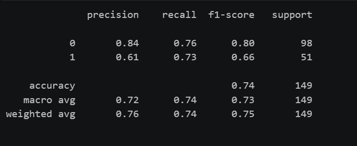

# Task-1-MarkHanyAdel


# 🩺 End-to-End Diabetes Prediction Using Support Vector Machines (SVM)

[](https://www.python.org)
[](https://scikit-learn.org/)
[](https://pandas.pydata.org/)
[](https://seaborn.pydata.org/)

A robust Machine Learning pipeline designed to predict diabetes diagnostic status with high structural reliability. This project leverages an optimized **Support Vector Machine (SVM)** classifier combined with thorough Exploratory Data Analysis (EDA), class-conditional data preprocessing, and strict feature normalization to achieve robust clinical screening.

---

## 📊 Model Evaluation Results

Below is the verified classification report detailing the evaluation metrics achieved by the trained **SVM model** on the test subset:



---

## 💾 Dataset Link

The analysis and model training are performed on the Pima Indians Diabetes Dataset. You can access and download the dataset here:
🔗 **[Download / Access Diabetes Dataset](https://www.kaggle.com/datasets/johndasilva/diabetes)** *(Replace this with your actual GitHub or Kaggle data link)*

---

## 🚀 Pipeline Architecture & Core Details

### 1. Exploratory Data Analysis (EDA) & Auditing
* **Statistical Profiling:** Conducted full validation checks on central tendencies, variance, and individual feature distributions across clinical metrics.
* **Correlation Mapping:** Utilized Seaborn heatmaps to identify strong linear/non-linear feature interactions and avoid structural multicollinearity.
* **Zero-Value Analysis:** Detected highly abnormal and biologically impossible zero values across critical physiological columns (`Glucose`, `BloodPressure`, `SkinThickness`, `Insulin`, `BMI`).

### 2. Advanced Clinical Data Preprocessing
* **Conditional Median Imputation:** Instead of discarding data or using a naive global mean, invalid zeros were replaced with feature-specific **median values calculated with respect to the outcome class**. This preserves the underlying biological distribution and prevents data leakage.
* **Outlier Mitigation:** Handled extreme edge cases to maximize the model's geometric margin generalization.

### 3. Feature Scaling & Validation Setup
* **Train-Test Split:** Structured using a reproducible **75% Train / 25% Test split** strategy.
* **Standardization:** Applied `StandardScaler` to perform $z$-score normalization across all continuous features. Because **SVM maximizes the margin between data points based on Euclidean distance**, proper scaling is essential to prevent high-magnitude features from dominating the decision boundary.

### 4. Support Vector Machine (SVM) Classification
An optimized SVM classifier was implemented to find the optimal hyperplane that separates diabetic and non-diabetic patient profiles. 

#### 📈 SVM Performance Breakdowns
* **Overall Model Accuracy:** `74.5%`
* **Total Evaluation Support:** 149 test profiles

| Target Class | Metric | Score | Sample Support |
| :--- | :--- | :--- | :--- |
| **Class 0 (Non-Diabetic)** | Precision <br> Recall <br> F1-Score | **84%** <br> **76%** <br> **80%** | 98 patients |
| **Class 1 (Diabetic)** | Precision <br> Recall <br> F1-Score | **61%** <br> **73%** <br> **66%** | 51 patients |

---

## 🛠️ Technology Stack & Environment

The mathematical and scientific execution relies on the following core dependencies:

```python
import pandas as pd              # Structured data manipulation
import numpy as np               # Vectorized matrix mathematical operations
import matplotlib.pyplot as plt     # Core declarative layout plotting
import seaborn as sns            # Advanced statistical data visualization
from sklearn.model_selection import train_test_split
from sklearn.preprocessing import StandardScaler
from sklearn.svm import SVC      # Support Vector Classifier
from sklearn.metrics import accuracy_score, classification_report
```
## 📁 Project Structure

```text
.
├── README.md
└── Diabetes/
    ├── Classification_Report_UI.png   # Model evaluation results
    ├── Dataset/
    │   └── diabetes.csv               # Raw clinical dataset
    └── Notebook/
        └── Notebook_Diabetes.ipynb    # Full ML pipeline notebook          

